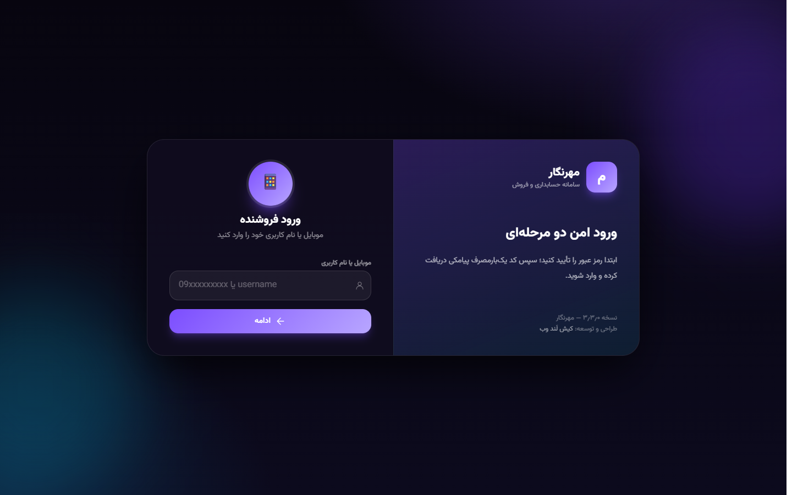
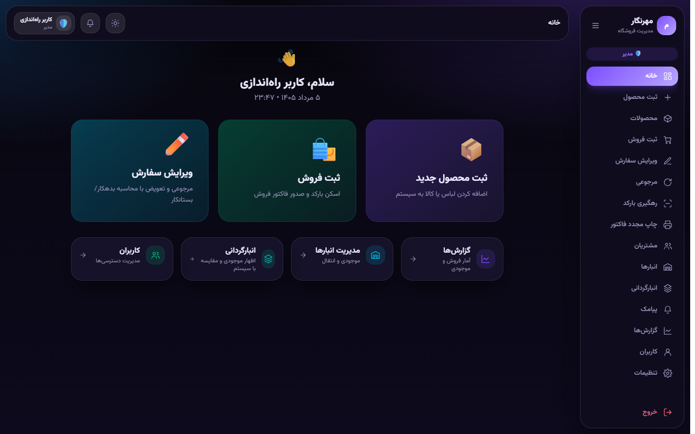
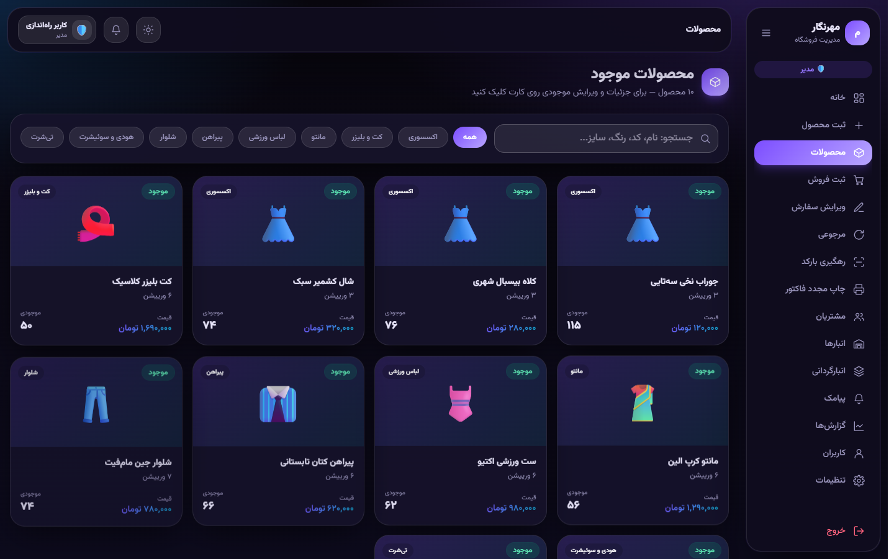
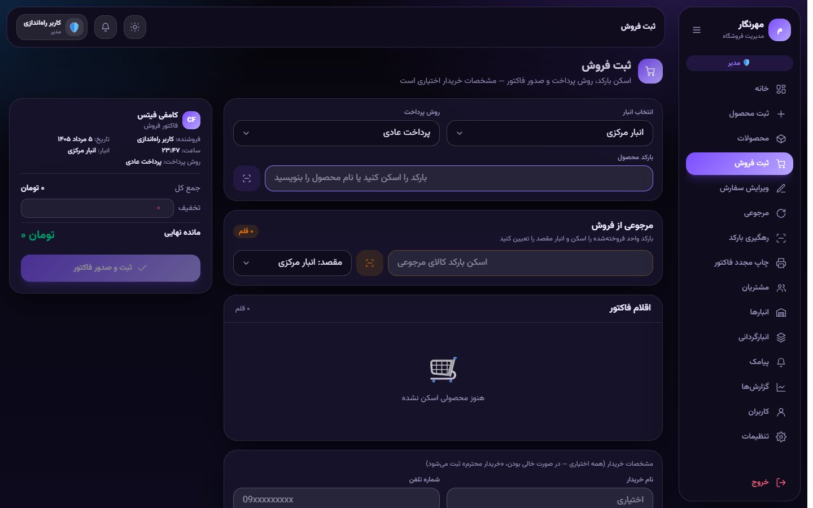
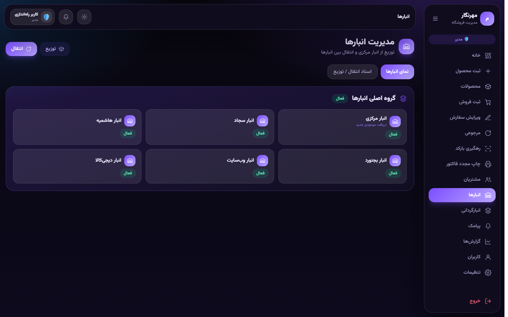
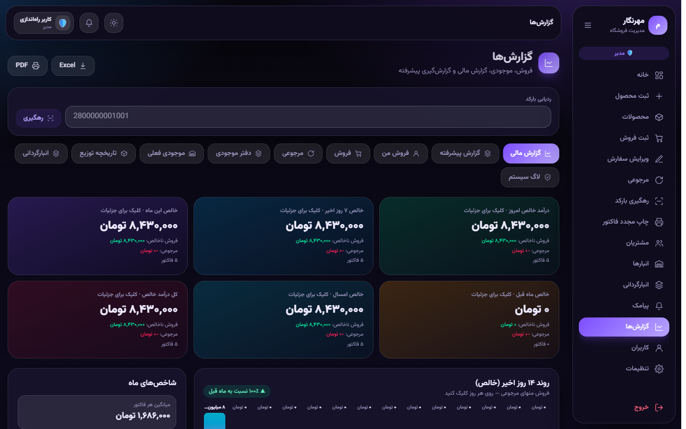
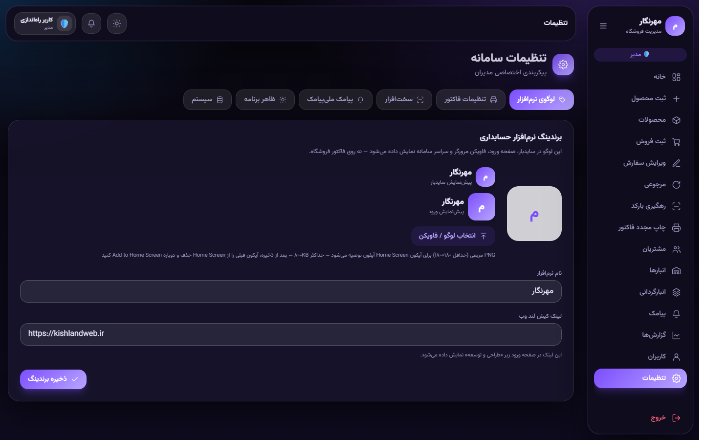
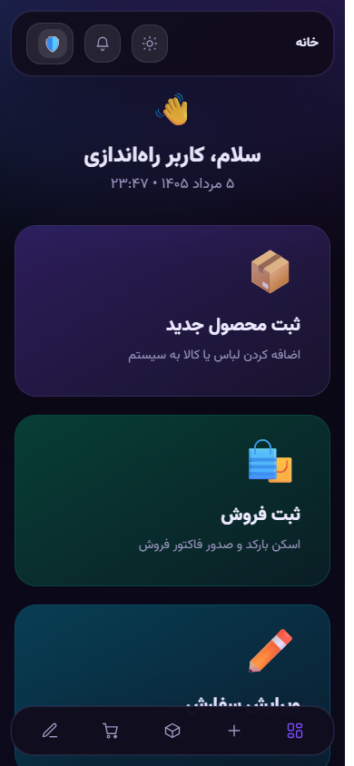

# مهرنگار — پیش‌نمایش محصول

سامانه حسابداری و فروش فروشگاهی (POS + Inventory) — این مخزن **فقط ویترین عمومی** است: اسکرین‌شات، خلاصه امکانات و لینک دمو.

> **سورس کد کامل خصوصی است** و در این ریپو منتشر نمی‌شود.  
> برای دیدن کد در مصاحبه، دسترسی موقت داده می‌شود.

---

## Live demo

**[باز کردن پیش‌نمایش رابط](./demo.html)**

| نقش | نام کاربری | رمز |
|-----|------------|-----|
| مدیر | `bardiya` | `Admin@1234` |
| فروشنده | `sultan` | `User@1234` |

این پیش‌نمایش یک تور اسکرین‌شات است (بدون اجرای سورس اپ). روی صفحه دمو دکمه‌های **ورود سریع** هم هست.

---

## امکانات

- ورود دو مرحله‌ای (رمز + OTP) — در دمو کد روی صفحه نمایش داده می‌شود
- محصولات با رنگ/سایز و بارکد واحد
- ثبت فروش، مرجوعی، ویرایش سفارش، چاپ مجدد فاکتور
- چند انبار، توزیع و انتقال موجودی، انبارگردانی
- گزارش مالی/فروش و خروجی Excel/PDF
- پیامک فروش و تنظیمات برندینگ
- رابط واکنش‌گرا (دسکتاپ و موبایل)

---

## پیش‌نمایش رابط

### ورود



### داشبورد



### محصولات



### ثبت فروش



### انبارها



### گزارش‌ها



### تنظیمات



### موبایل



---

## Tech stack

- **Frontend / App:** Next.js 16 · React 19 · TypeScript · Tailwind CSS 4
- **Backend:** Next.js Route Handlers (API)
- **Database:** PostgreSQL · Drizzle ORM
- **Other:** OTP/SMS integration · barcode · Playwright screenshots

---

## Architecture (high level)

```text
Browser (RTL UI)
    │
    ▼
Next.js App Router
    ├── Pages / Client UI
    └── /api/*  (auth, products, invoices, inventory, reports, sms)
            │
            ▼
        PostgreSQL
```

---

## Resume blurb (EN)

> **Mehrnegar** — Full-stack retail POS & accounting app (Next.js, React, PostgreSQL). Features OTP auth, barcode sales, multi-warehouse inventory, reporting exports, and SMS notifications. Live demo available; source is private.

---

## Note

این مخزن عمداً بدون سورس اپلیکیشن منتشر شده تا منطق کسب‌وکار قابل کپی نباشد؛ برای ارزیابی فنی از دمو و در صورت نیاز از walkthrough در مصاحبه استفاده کنید.

توسعه: [کیش لَند وب](https://kishlandweb.ir)
